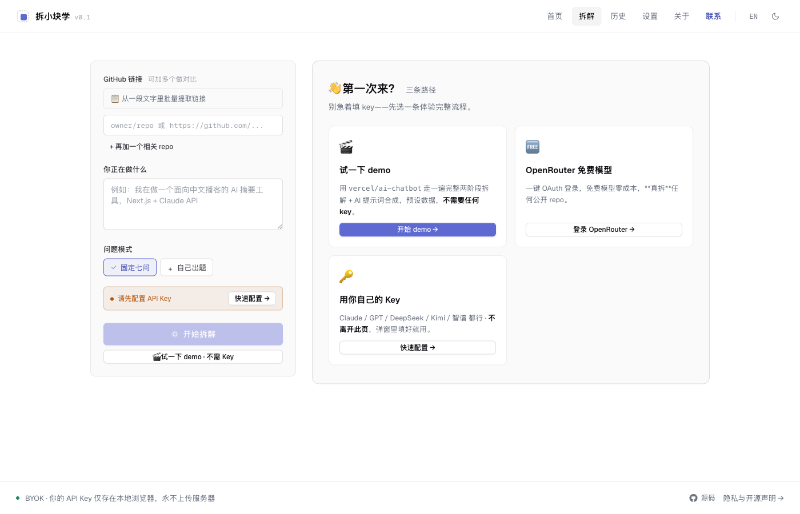
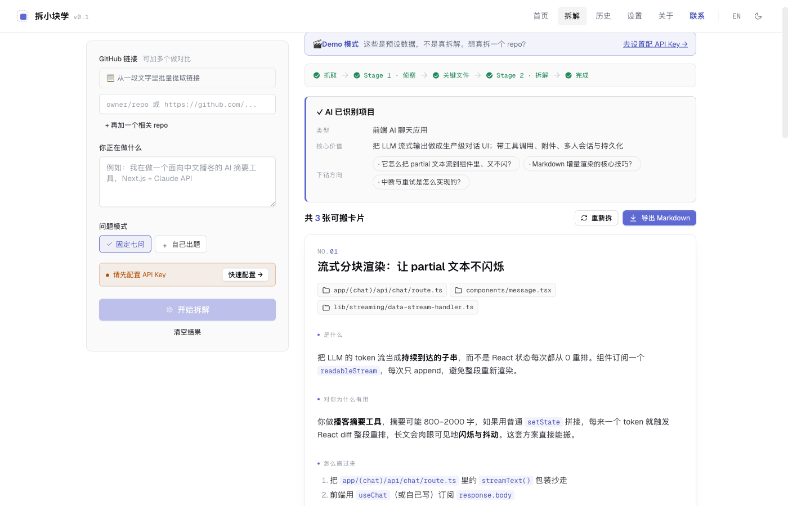

# 拆小块学 · GitHub 项目拆解助手 (MVP v0.1)

[](./LICENSE)
[](https://chai-xiao-kuai-xue.vercel.app)
[](https://chai-xiao-kuai-xue.vercel.app/about#privacy)
[](https://nextjs.org/)

[🇺🇸 English](./README.md) · 🇨🇳 **中文**

> 不要学习一个项目，学习它对你有用的那一小块。

一个纯前端的 GitHub 项目拆解工具。粘贴一个 repo 链接 + 你正在做的项目背景，
AI 帮你拆出 3-8 张「能直接搬到你项目里」的小模块卡片，每张都附上是什么、
为什么对你有用、具体怎么搬、源码片段。

## 截图


*第一步 —— 粘贴 GitHub 链接、写清自己在做什么、挑一个出题模式。*


*第二步 —— 拿到模块卡片：每张都说明是什么、对你为什么有用、怎么搬，以及对应源码片段。*

## 运行

```bash
cd web
npm install
npm run dev    # http://localhost:3000
```

构建生产版本：

```bash
npm run build
npm run start
```

## 技术栈

- **框架**：Next.js 14（App Router）+ React 18 + TypeScript
- **样式**：Tailwind CSS 3.x（手写组件，未引入 shadcn/ui）
- **状态**：Zustand + persist 中间件（localStorage）
- **Markdown**：react-markdown + remark-gfm
- **LLM SDK**：`@anthropic-ai/sdk` / `openai`（均启用 `dangerouslyAllowBrowser`）
- **GitHub**：浏览器直连匿名 Public API（60 次/小时/IP）

## 架构

```
web/
├─ app/
│  ├─ page.tsx          # 落地页 /
│  ├─ analyze/page.tsx  # 核心拆解页 /analyze
│  ├─ settings/page.tsx # API Key 配置 /settings
│  ├─ about/page.tsx    # 理念与隐私 /about
│  ├─ layout.tsx        # 全局 layout (nav + footer)
│  └─ globals.css
├─ components/
│  ├─ ApiKeySetup.tsx    # Provider 选择 + Key 输入 + Model 下拉
│  ├─ GitHubInput.tsx    # URL 输入 + userContext textarea
│  ├─ ModeSelector.tsx   # 固定七问 / AI 动态出题 / 自己出题
│  ├─ ResultsPanel.tsx   # Stage 1/2 进度 + 模块卡片列表
│  ├─ ModuleCard.tsx     # 单张卡片（含复制/源文件 chips）
│  └─ PrivacyNotice.tsx  # BYOK 风险提示
├─ lib/
│  ├─ analyze.ts         # 两阶段编排 + Markdown 导出
│  ├─ github.ts          # GitHub 抓取 + sessionStorage 缓存
│  ├─ store.ts           # Zustand 全局设置（含 persist）
│  ├─ utils.ts           # cn / parseGitHubUrl / parseLLMJson / 等
│  ├─ providers/
│  │  ├─ index.ts        # LLMProvider 接口 + 错误归类
│  │  ├─ anthropic.ts
│  │  └─ openai.ts
│  └─ prompts/
│     ├─ seven-questions.ts
│     ├─ stage1.ts       # 侦察阶段 prompt
│     └─ stage2.ts       # 拆解阶段 prompt
└─ ...
```

## 数据流（两阶段）

```
用户输入 → GitHubInput              ┐
        + ModeSelector             ├→ runAnalyze()
        + (Settings.apiKey/model)  ┘        │
                                            ├─ 1. fetchRepoBundle()       (GitHub Public API)
                                            ├─ 2. Stage 1 LLM stream     (project_type / core_value
                                            │                              / files_to_read_next
                                            │                              / suggested_questions)
                                            ├─ 3. fetchKeyFiles()         (raw.githubusercontent)
                                            └─ 4. Stage 2 LLM stream     (modules[])
                                                  │
                                                  └→ ResultsPanel → ModuleCard ×N
```

## 隐私（BYOK）

- 你的 API Key 仅保存在浏览器的 `localStorage`（key：`dissect-mvp-settings`）
- 所有 LLM 请求由浏览器直连官方 API，**没有任何运营方服务器中转**
- GitHub 抓取使用匿名身份，仅支持公开 repo
- 无 cookies、无埋点、无第三方追踪
- 完整声明见 `/about`

## 24 条 Criteria 对照表

| # | 条目 | 实现位置 | 状态 |
|---|---|---|---|
| 1 | 一句话理念明确 | `app/page.tsx` Hero + `app/about/page.tsx` | √ |
| 2 | 输入：GitHub URL（含 owner/repo 简写） | `components/GitHubInput.tsx` + `lib/utils.ts:parseGitHubUrl` | √ |
| 3 | 输入：用户项目背景 textarea | `components/GitHubInput.tsx` | √ |
| 4 | 三种模式：固定七问 / AI 动态出题 / 自己出题 | `components/ModeSelector.tsx` + `lib/prompts/seven-questions.ts` | √ |
| 5 | 模式可多选 + 至少一项 | `ModeSelector.toggleMode` | √ |
| 6 | BYOK：API Key 仅本地 localStorage | `lib/store.ts` (zustand persist) | √ |
| 7 | 支持 Claude + OpenAI 两个 provider | `lib/providers/{anthropic,openai}.ts` | √ |
| 8 | Provider 抽象出 `stream()` 统一接口 | `lib/providers/index.ts:LLMProvider` | √ |
| 9 | 启用 `dangerouslyAllowBrowser` 并显著告知用户 | providers + `PrivacyNotice` | √ |
| 10 | 两阶段拆解（侦察 + 拆模块） | `lib/analyze.ts:runAnalyze` + `prompts/stage1,2` | √ |
| 11 | Stage 1 输出文件名 → Stage 2 抓真实文件 | `analyze.ts` 调 `fetchKeyFiles` | √ |
| 12 | 输出结构化卡片（title/what/why/how/code/source） | `lib/prompts/stage2.ts:Module` + `ModuleCard.tsx` | √ |
| 13 | LLM 流式响应 | providers `stream()` + analyze `consumeStream` | √ |
| 14 | UI 实时反馈各阶段进度 | `ResultsPanel` phase label + partial text details | √ |
| 15 | 单张卡片可复制 Markdown | `ModuleCard.handleCopyCard` | √ |
| 16 | 代码段可单独复制 | `ModuleCard.handleCopyCode` | √ |
| 17 | 整批导出为 Markdown 文件 | `ResultsPanel` + `lib/analyze.ts:modulesToMarkdown` | √ |
| 18 | GitHub 限额/私有/404 友好错误 | `lib/github.ts:GitHubError` + `ResultsPanel` | √ |
| 19 | LLM 401/429/网络错误友好分类 | `lib/providers/index.ts:classifyLLMError` | √ |
| 20 | repo bundle 缓存 1 小时（sessionStorage） | `lib/github.ts:readCachedBundle` | √ |
| 21 | 中文界面 + 中文 prompt | 全站 | √ |
| 22 | 落地页 / 拆解页 / 设置页 / 关于页 4 个路由 | `app/{page,analyze,settings,about}/page.tsx` | √ |
| 23 | 完整隐私声明页（含 dangerouslyAllowBrowser 风险） | `app/about/page.tsx` + `PrivacyNotice` | √ |
| 24 | 取消进行中的分析（AbortController） | `app/analyze/page.tsx:handleAbort` + providers signal | √ |

## 已知限制 / 剩余风险

1. **GitHub 匿名限额 60/h/IP**：抓 1 个 repo 大约消耗 3-12 次 API（取决于目录数量），
   重度使用会触发 429。下个版本计划支持可选 GitHub Token。
2. **私有 repo 不支持**：MVP 只读公开 repo。
3. **大型 repo 的取舍**：根目录文件树最多取 2 层、至多展开 8 个子目录、
   关键文件每个最多 40KB、README 最多 12000 字符。超过会截断。
4. **dangerouslyAllowBrowser**：浏览器扩展或同源脚本理论上能读 Key。
   生产场景建议为本工具单独申请限额受控的 Key。
5. **SDK 版本可能漂移**：`@anthropic-ai/sdk` 流式事件结构在不同小版本会变；
   当前实现兼容 0.39.x 的 `content_block_delta`/`text_delta` 形式。
6. **流式 UI**：当前用 `<details>` 折叠展示 partial JSON，
   没有边解析边渲染单张卡片（因为 stage2 是单个 JSON 对象，难以稳健的增量解析）。
   下个版本可考虑每张卡片单独一次 LLM 调用。
7. **shadcn/ui 未接入**：PRD 建议用 shadcn/ui，本 MVP 选择手写 Tailwind 组件
   以降低脚手架体积。视觉风格统一，不影响功能。
8. **模型列表硬编码**：`lib/store.ts` 里固定了 4 个 Claude + 4 个 OpenAI 型号。
   新模型上线需要手动加。
9. **未做端到端测试**：MVP 阶段未引入 Playwright；本次仅做 typecheck + build 验证。
10. **`claude-opus-4-7` / `claude-sonnet-4-6` 等模型 ID 是占位**：
    需要按实际可用模型 ID 校准（参见 Anthropic 官方文档）。

## License

MIT —— 详见 [`LICENSE`](./LICENSE)。

---
Co-Authored-By: Claude Opus 4.7 (1M context)
